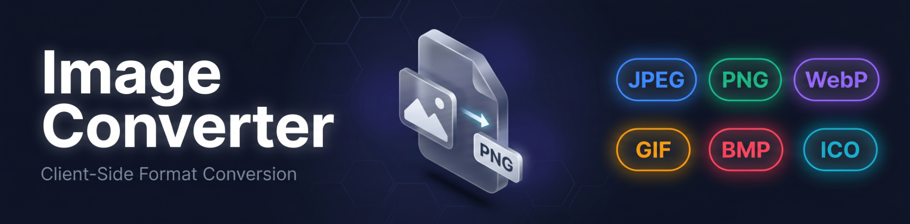
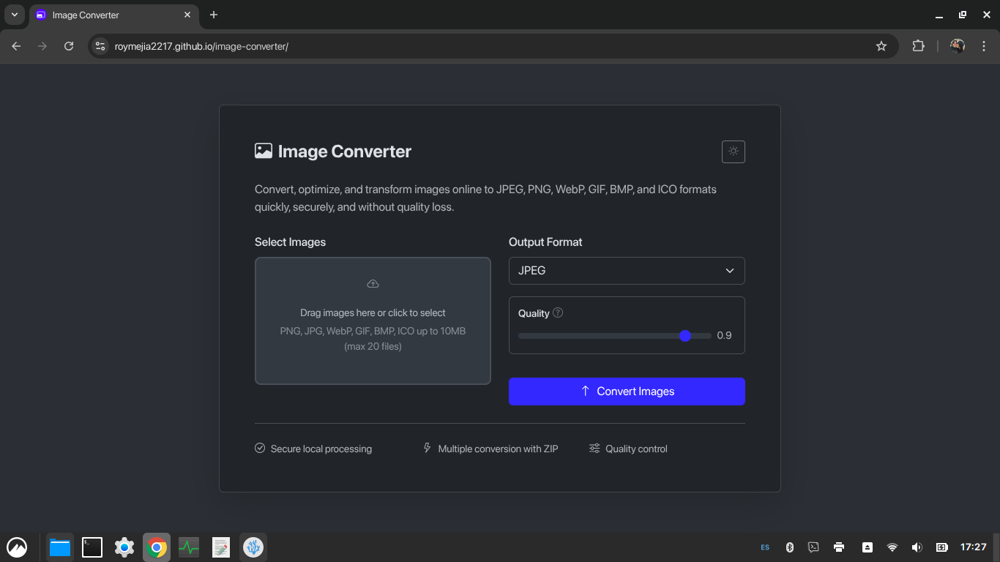

<p align="center">
  
</p>

<h1 align="center">image-converter</h1>

<p align="center">
  <a href="https://nodejs.org/">
    
  </a>
  <a href="https://vite.dev/">
    
  </a>
  <a href="https://getbootstrap.com/">
    
  </a>
  
</p>

<p align="center">
  A browser-based image converter for JPEG, PNG, WebP, GIF, BMP, and ICO files with local processing and ZIP export.
</p>

---

## Quick Start

```bash
git clone https://github.com/roymejia2217/image-converter.git
cd image-converter
npm install
```

```bash
npm run dev
```

---

## Features

| Feature | Description |
|---------|-------------|
| **Local image processing** | Converts files in the browser without uploading images to a server. |
| **Drag-and-drop upload** | Accepts selected files or dropped files through the browser interface. |
| **Input validation** | Validates file extensions, MIME types, magic bytes, file size, empty files, and file names before conversion. |
| **Multi-format conversion** | Converts images to JPEG, PNG, WebP, GIF, BMP, and ICO output formats. |
| **Format-specific options** | Exposes quality controls for JPEG and WebP, max colors for GIF, bit depth for BMP, and icon size presets for ICO. |
| **ICO generation** | Builds ICO files with selectable 16, 32, 48, 64, 128, and 256 pixel entries. |
| **ICO extraction** | Extracts embedded ICO entries as PNG files and packages multiple entries into a ZIP archive. |
| **Batch export** | Downloads one converted file directly or packages multiple converted files into a ZIP archive. |
| **Progress feedback** | Updates a conversion progress bar as each selected file is processed. |
| **Preview lazy loading** | Uses lazy-loaded thumbnails and object URL cleanup to reduce memory pressure while handling selected files. |
| **Theme switching** | Supports automatic dark mode detection and a manual theme toggle. |

---

## Prerequisites

| Dependency | Purpose | Installation |
|------------|---------|--------------|
| **Node.js** >=18.0.0 | Runs the Vite development server, build pipeline, and test tooling. | [Download Node.js](https://nodejs.org/) |
| **npm** >=9.0.0 | Installs project dependencies and runs package scripts. | Included with Node.js |

**Note:** The application accepts up to 20 files per batch, each up to 10 MB.

---

## Installation

```bash
npm install
npm run build
npm run preview
```

---

## Usage

```bash
npm run dev
```

1. Open the local Vite URL shown in the terminal.
2. Select images with the file picker or drag images into the upload area.
3. Choose the output format from the format selector.
4. Adjust the format-specific options that appear for the selected format.
5. Run the conversion and save the downloaded file or ZIP archive.

**ICO behavior:**
- ICO output uses the selected size presets. Sizes below 256 pixels are encoded as BMP-derived DIB entries, and the 256 pixel entry is embedded as PNG.
- ICO input is decoded into PNG files. Multiple embedded entries are downloaded as a ZIP archive.

**Supported formats:**
- Input validation accepts `.jpg`, `.jpeg`, `.png`, `.webp`, `.gif`, `.bmp`, and `.ico` files.
- Output formats are JPEG, PNG, WebP, GIF, BMP, and ICO.

---

## Project Structure

```text
image-converter/
├── docs/
│   ├── banner.webp
│   └── screenshots/
│       └── homepage.webp
├── public/
│   └── favicon.ico
├── src/
│   ├── __tests__/
│   ├── config/
│   │   ├── app-config.js
│   │   ├── canvas-config.js
│   │   ├── config.js
│   │   ├── format-configs.js
│   │   └── tooltips.js
│   ├── core/
│   │   ├── canvas-pool.js
│   │   ├── lazy-loader.js
│   │   ├── logger.js
│   │   ├── memory-manager.js
│   │   ├── metrics.js
│   │   └── state.js
│   ├── handlers/
│   │   └── event-handlers.js
│   ├── init/
│   │   └── init.js
│   ├── utils/
│   │   ├── encoders.js
│   │   ├── ico-encoder.js
│   │   ├── ico-resize.js
│   │   └── utils.js
│   ├── script.js
│   └── style.css
├── index.html
├── package.json
├── vite.config.js
└── vitest.config.js
```

---

## Testing

```bash
npm test
npm run test:coverage
```

Test coverage includes:
- `canvas-pool.test.js`: canvas pool behavior.
- `config.test.js`: application and format configuration.
- `encoders.test.js`: image encoder utilities.
- `event-handlers.test.js`: file handling and conversion event logic.
- `ico-encoder.test.js`: ICO encoding and decoding.
- `ico-resize.test.js`: ICO resizing helpers.
- `lazy-loader.test.js`: lazy loading behavior.
- `logger.test.js`: logging utilities.
- `memory-manager.test.js`: object URL and memory cleanup.
- `utils-pure.test.js`: pure utility functions.

---

## Credits

| Project | Description | License |
|---------|-------------|---------|
| [Bootstrap](https://getbootstrap.com/) | Provides the responsive interface components and layout styles. | MIT |
| [Bootstrap Icons](https://icons.getbootstrap.com/) | Provides the icon set used by the browser interface. | MIT |
| [JSZip](https://github.com/Stuk/jszip#readme) | Creates ZIP archives for multi-file conversion output and ICO extraction output. | MIT OR GPL-3.0-or-later |
| [omggif](https://github.com/deanm/omggif#readme) | Encodes GIF output with a generated color palette. | MIT |

---

## Screenshots

| Screenshot | Description |
|---|---|
|  | Browser interface for selecting images, choosing an output format, and running conversions. |

---

## License

MIT License. See [LICENSE](LICENSE) for details.
